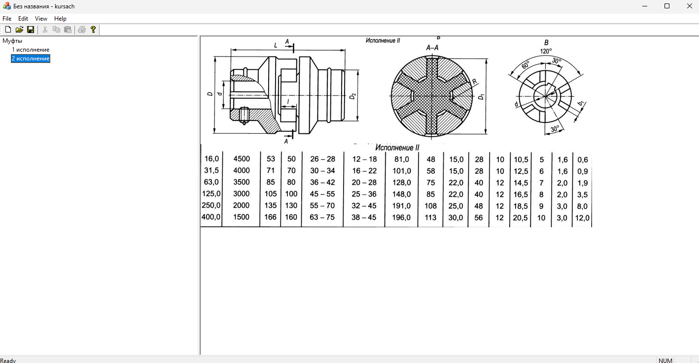
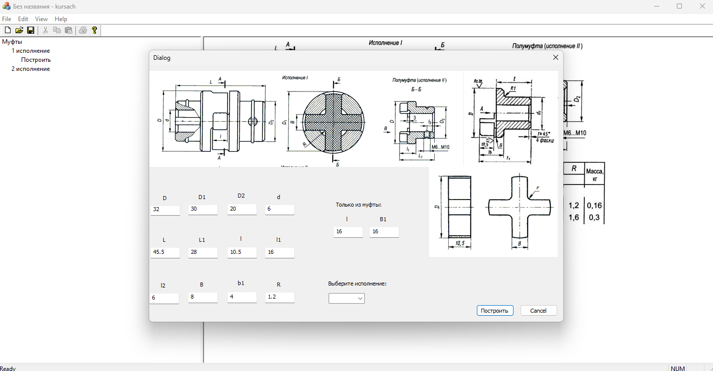
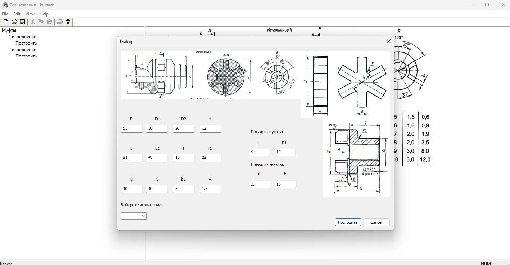
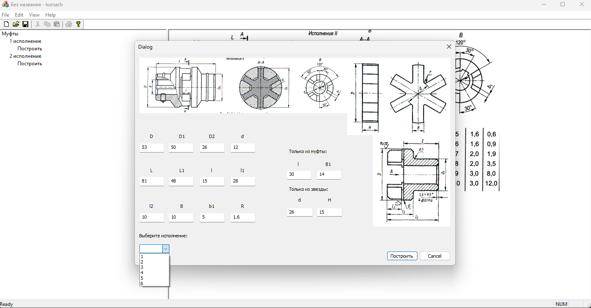
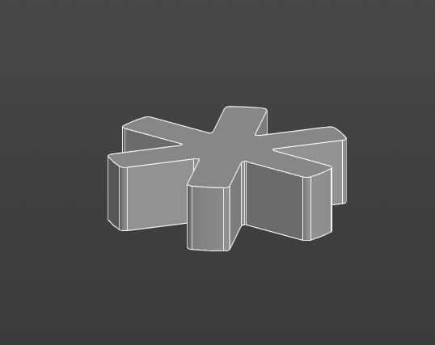
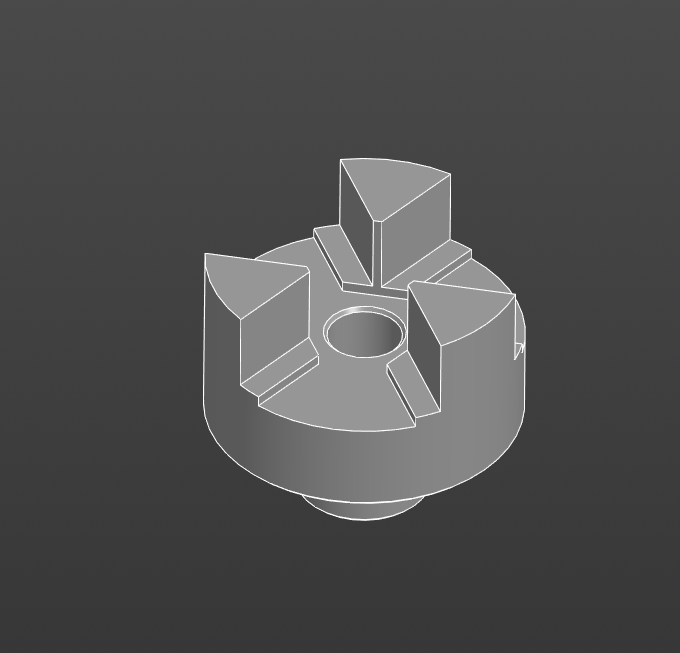
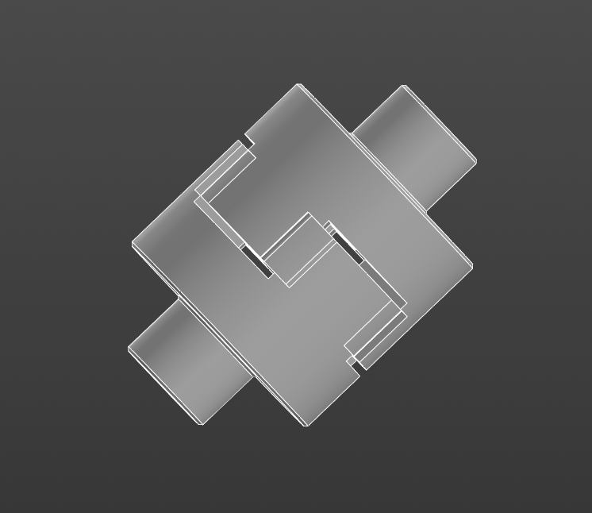

# Проект: Параметрическая сборка компенсирующей упругой муфты

## Описание проекта
Этот проект представляет собой SDI MFC приложение на C++, предназначенное для создания параметрических сборок компенсирующих упругих муфт в приложении КОМПАС 3D. Пользователь может выбирать различные исполнения и муфты с определенными крутящими моментами, а затем строить выбранную муфту в приложении КОМПАС 3D.

## Особенности
- **Интерфейс SDI MFC**: Проект построен с использованием SDI MFC для удобного взаимодействия с пользователем.
- **Дерево конфигурации (CMyTreeView)**: Реализовано дерево, позволяющее пользователю выбирать конкретные исполнения и параметры муфт.
- **Диалоговое окно первого исполнения (CNewDialog)**: Диалог для выбора параметров первого исполнения.
- **Диалоговое окно второго исполнения (CNewDialog2)**: Диалог для выбора параметров второго исполнения.
- **Интеграция с КОМПАС 3D**: Проект взаимодействует с API КОМПАС 3D для построения выбранной муфты в приложении.

## Использование
1. **Выбор исполнения**: В дереве конфигурации выберите нужное исполнение, кликнув по соответствующему узлу.
2. **Выбор муфты**: Внутри исполнения выберите муфту с определенным крутящим моментом, используя соответствующие диалоговые окна.
3. **Построение**: Нажмите кнопку "Построить", чтобы построить выбранную муфту в КОМПАС 3D.

## Требования к среде разработки
- **Visual Studio**: Проект разработан с использованием Visual Studio.
- **КОМПАС 3D API**: Необходима установленная библиотека или API КОМПАС 3D для взаимодействия с приложением.

## Структура проекта
- **MainApp (kursach)**: Исходный код основного приложения.
- **CMyTreeView**: Реализация дерева конфигурации.
- **CNewDialog**: Диалоговое окно первого исполнения.
- **CNewDialog2**: Диалоговое окно второго исполнения.
- **Resources**: Ресурсы приложения.
- **kursachDoc**: Документы проекта.
- **kursachView**: Представления проекта.
- **MainFrm**: Главное окно приложения.

## Скриншоты

